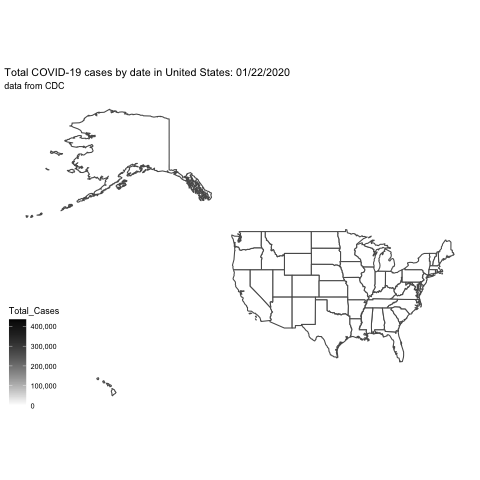

# Total-covid-cases-in-the-US-by-date-animation

Last week in TidyTuesday, I saw how easy it is to make a animated plot for data. So, I decided to try it on my own. The first thing comes to my mind, during a pandemic, is definitely the data of COVID-19. 

## Find data

First, I need to find the data about confirmed cases(or death) about the US on each day and in each state. Fortunately, it is not that hard to find. A csv file is available from CDC's website for downloading. 

Then, I need the data to draw a US map showing different states. This can be done by just googling "US map with states shapefile". The key words are "US map" and "shapefile". A [shapefile](https://desktop.arcgis.com/en/arcmap/10.3/manage-data/shapefiles/what-is-a-shapefile.htm#:~:text=A%20shapefile%20is%20a%20simple,%2C%20or%20polygons%20(areas).) contains information about the map. So, if you need any other maps, just google the location with the keyword "shapefile", you are very likely to find the right file.

```{r}
usmap <- sf::read_sf("states_21basic/")
covidUS <- read_csv("United_States_COVID-19_Cases_and_Deaths_by_State_over_Time.csv")
```

Then, the next thing is simplify the map data. Because it is large and thus will take time running the code. And in our case, we don't need a super detailed map.
We can use the function `sf::st_simplify` to do that. The argument `dTolerance` controls how much we want to simplify. The smaller the argument, the more it simplifies. By setting `dTolerance = 0.05`, the map data reduced a bit more than half from 296MB to 139MB.

```{r, echo = TRUE}
simplified <- usmap %>% 
  st_simplify(dTolerance = 0.05)

object.size(usmap)
object.size(simplified)
```
## Plot the animation

When the data is ready, we can use the following code for the plot. I am about to learn how to work with rational database in R4DS. So, I just copied and paste the code. The idea is to combine the data for map and covid cases so that we can plot them. Then, the `geom_sf()` function plots the map. The animation part is done by `transition_manual` and the scale is controlled by `scale_fill_gradient2`. 

```{r}
cumcases <- covidUS %>%
  select(submission_date, state, tot_cases, tot_death)

simplified %>% 
  inner_join(cumcases, by = c(STATE_ABBR = "state")) %>%
  mutate(Total_Cases = as.integer(tot_cases)) %>%
  ggplot(aes(fill = Total_Cases)) +
  geom_sf() + 
  transition_manual(submission_date) + 
  scale_fill_gradient2(high = "black", midpoint = 0.5,label=scales::comma) + 
  ggthemes::theme_map() + 
  labs(title = "Total COVID-19 cases by date in United States: {current_frame}",
       subtitle = "data from CDC")
```

 

Voila! Just wait to see the animated plot. It is surprisingly simple and effective for this demonstration. It is really convenient to work with `tidyverse` and `ggplot`. It opens a new gate for using R to analyze data. And the book R4DS is awesome starting point. Not only it introduces this beautiful way to use R with a thorough explanation, it also gives you a feeling how it is like to work with data in real life. I am very glad I started to read this book.

